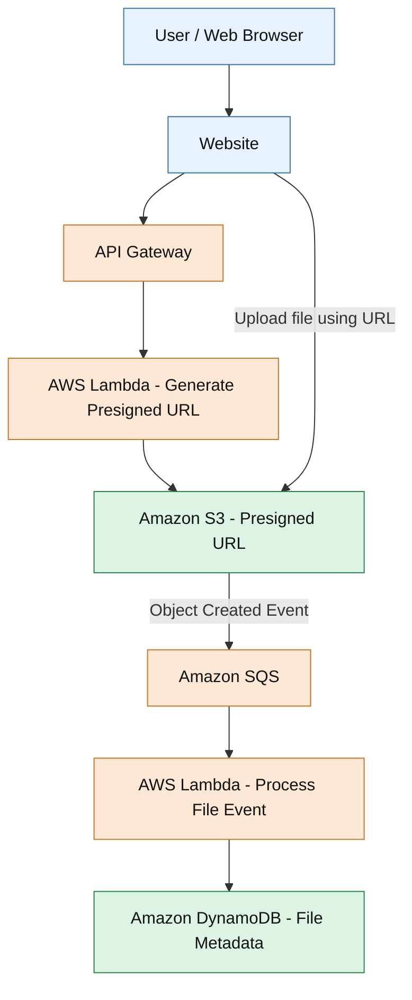

# Cloud-File-Flow
## Overview

Cloud File Flow is an AWS serverless project that accepts file uploads through a web interface and automatically processes file metadata using an event-driven architecture.

The project demonstrates how AWS services can work together to build a scalable file-ingestion workflow, with Terraform used to manage infrastructure as code..

---

## Features

* Secure File Uploads

* Automated Event Notifications

* Asynchronous Processing

* Metadata Storage

* API Integration

* End-to-End Testing

---

## Architecture Diagram

