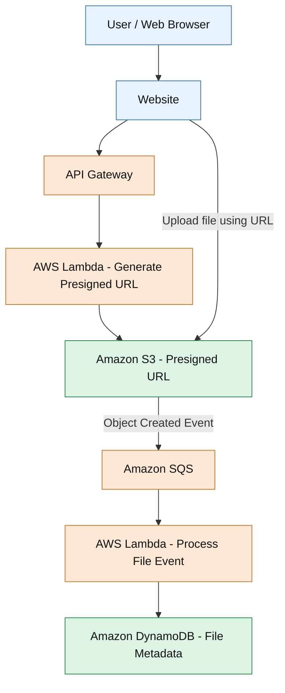
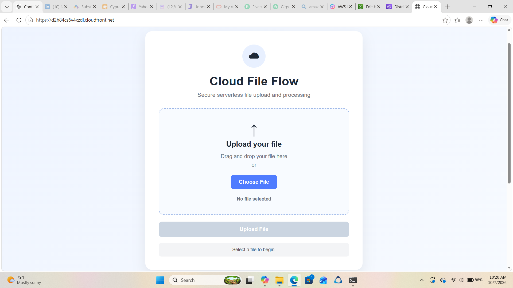
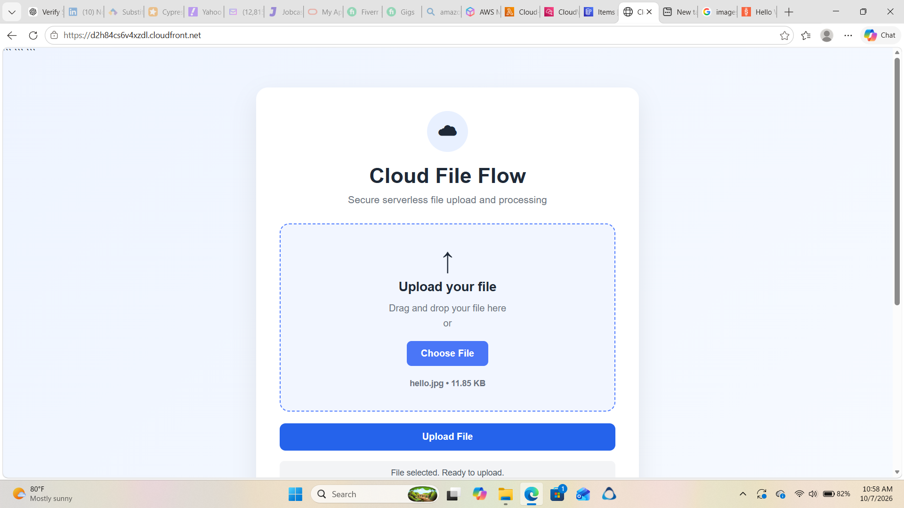
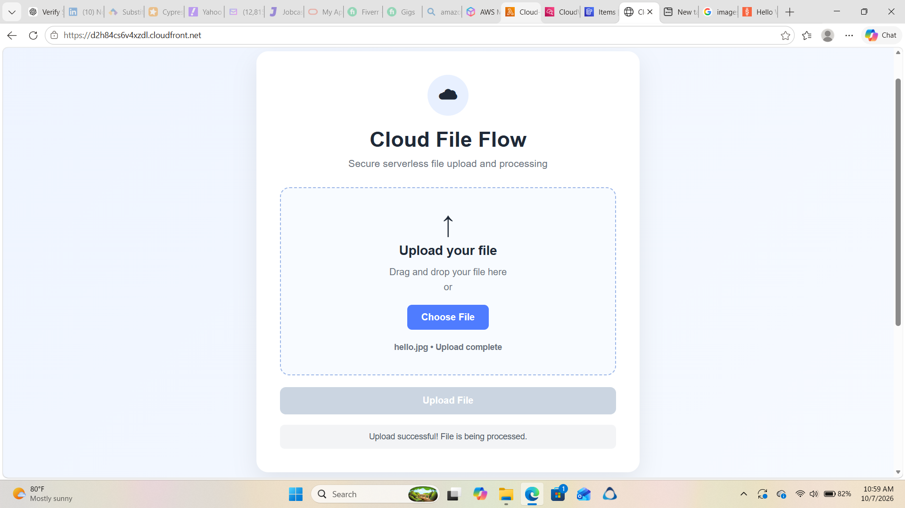
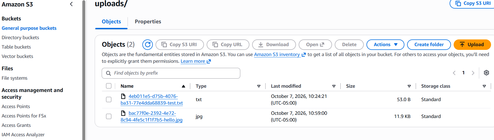
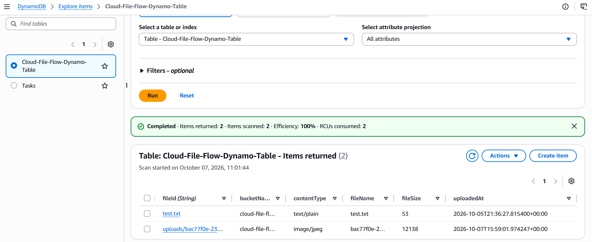

# Cloud-File-Flow
## Overview

Cloud File Flow is an AWS serverless project that accepts file uploads through a web interface and automatically processes file metadata using an event-driven architecture.

The project demonstrates how AWS services can work together to build a scalable file-ingestion workflow, with Terraform used to manage infrastructure as code..

---

## Features

* Secure File Uploads

* Automated Event Notifications

* Asynchronous Processing

* Metadata Storage

* API Integration

* End-to-End Testing

---

## Architecture Diagram


---
## Tech Stack

* **Frontend:** HTML, CSS, JavaScript
* **Backend:** AWS Lambda (Python)
* **File Storage:** Amazon S3
* **Message Queue:** Amazon SQS
* **Database:** Amazon DynamoDB
* **API Layer:** Amazon API Gateway (HTTP API) — presigned URL generation
* **Access Control:** AWS IAM
---
## API Endpoints

The HTTP API provides an endpoint for generating presigned URLs for direct file uploads to Amazon S3.

| Method | Endpoint | Description |
|---|---|---|
| POST | `/upload` | Request a presigned URL to upload a file directly to Amazon S3 |

---
## DynamoDB Table Design

**Table Name:** `Cloud-File-Flow-Terraform-Dynamo-Table`

**Primary Key:** `fileId` (String)

The table stores metadata for files uploaded to Amazon S3.

| Attribute | Data Type | Description |
|---|---|---|
| `fileId` | String | Partition key; identifies the uploaded file |
| `bucketName` | String | Name of the S3 bucket containing the file |
| `fileName` | String | Name or object key of the uploaded file |
| `fileSize` | Number | File size in bytes |
| `uploadedAt` | String | Timestamp when the S3 upload event occurred |


### Sample Item

```json
{
  "fileId": "uploads/example.txt",
  "bucketName": "cloud-file-flow-terraform-bucket",
  "fileName": "uploads/example.txt",
  "fileSize": 1024,
  "uploadedAt": "2026-10-09T17:00:00.000Z"
}
```


---
## Implementation Steps

**Step 1:**  
Created an Amazon S3 bucket to store uploaded files.

**Step 2:**  
Configured an Amazon SQS queue to receive file-upload event notifications.

**Step 3:**  
Developed an AWS Lambda function to process messages from SQS.

**Step 4:**  
Configured Amazon S3 event notifications to send object-created events to SQS.

**Step 5:**  
Implemented Lambda logic to extract file metadata, including the file name, bucket name, file size, and upload timestamp.

**Step 6:**  
Created an Amazon DynamoDB table to store file metadata.

**Step 7:**  
Configured IAM permissions to allow the Lambda function to access the required AWS resources.

**Step 8:**  
Tested the end-to-end workflow by uploading files to S3 and verifying metadata storage in DynamoDB.

---
## Screenshots

### Website Homepage



### Upload-File



### File Upload Scuccessful



### S3-Bucket-After-Upload



### File-Upload-Completed-Dynamo-Table




---

## Repository Structure

```text
cloud-file-flow/
├── lambda/
│   └── cloud-file-flow-lambda.py
├── screenshots/
│   └── homepage.png
│   └── file_selected_hello.png
│   └── uploaded.png
│   └── s3_bucket.png
│   └── dynamo-table-uploaded.png
|__ website/
│   └── index.html
│   └── script.js
│   └── style.css
├── README.md

```
## Security Best Practices

* Implemented a serverless, event-driven architecture using Amazon S3, SQS, Lambda, and DynamoDB.

* Used IAM roles and resource-specific permissions to control access to AWS services.

* Configured Amazon S3 event notifications to trigger asynchronous processing through SQS.

* Restricted Lambda permissions to the required S3 bucket and DynamoDB table.

* Used Amazon CloudWatch Logs to monitor Lambda execution and troubleshoot errors.

* Avoided hardcoding AWS credentials in application code.

---
---

